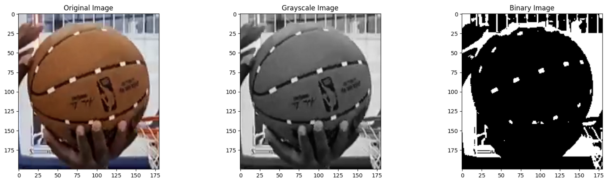
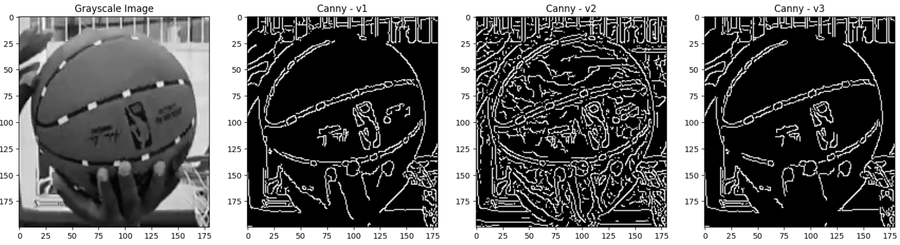
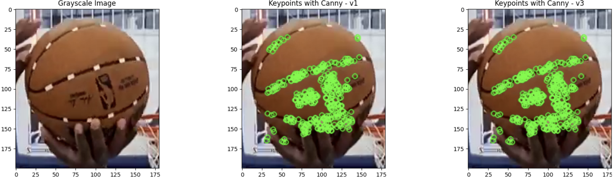
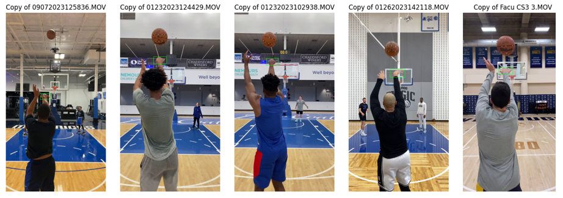
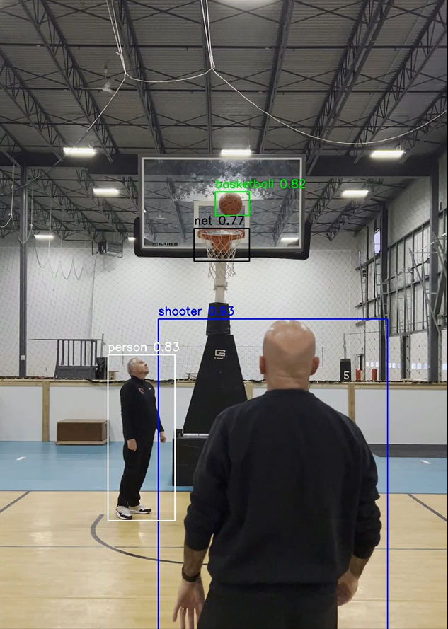

# Basketball Shot Analysis with Computer Vision

This project leverages computer vision to automate basketball shot analysis, focusing on detecting key frames like the release frame and identifying critical objects. The goal is to provide actionable insights to enhance player performance and coaching strategies.

## Highlights
- **Object Detection:** Fine-tuned YOLOv8 to detect basketball, shooter, and hands with high precision and recall.
- **Release Frame Detection:** Automated identification of the frame where the ball is released using a custom-trained YOLO class.
- **Tools Used:** OpenCV for video processing, Roboflow for annotation, and Google Colab Pro for development.

## Data Pipeline
1. **Data Collection:** Extracted frames (10th frame) from short videos (3–4 seconds, 60–100 fps).
2. **Annotation & Augmentation:** Annotated frames using [Roboflow](https://roboflow.com/) and enhanced dataset diversity with flipping and scaling.
3. **Training:** Fine-tuned YOLOv8-small model with 50 epochs, AdamW optimizer, and resized frames (640x640).

---

### Image Processing

Click to view image processing results

 **Figure:** Processed frames showing the detection of features for basketball shot analysis.

---

### Release Frame Detection

Click to view release frame detection results

 **Figure:** Frames showcasing the detection of the release frame in a basketball shot.

---

### Object Detection

Click to view object detection results

 **Figure:** YOLOv8 detections of the basketball, shooter, and other objects.

---

### Spin Axis Calculation

Click to view spin axis detection results

 **Figure:** Tracked white dots on the basketball used for spin axis calculations.

---

## Results
- **Detection Accuracy:** >95% precision and recall across classes (basketball, shooter, hand, net).
- **Model Metrics:** Precision-Recall curve highlights the YOLOv8 model’s reliability.

---

## Tools and Libraries
- **Libraries:** OpenCV, Roboflow, YOLOv8 by Ultralytics.
- **Platform:** Developed and tested on Google Colab Pro.

## Acknowledgements
This project was completed under the mentorship of [Coach Dave Love](https://www.instagram.com/coachdavelove/?hl=en) at CDL Basketball Enterprises, with support from Dr. Robert Fox and Roboflow.
